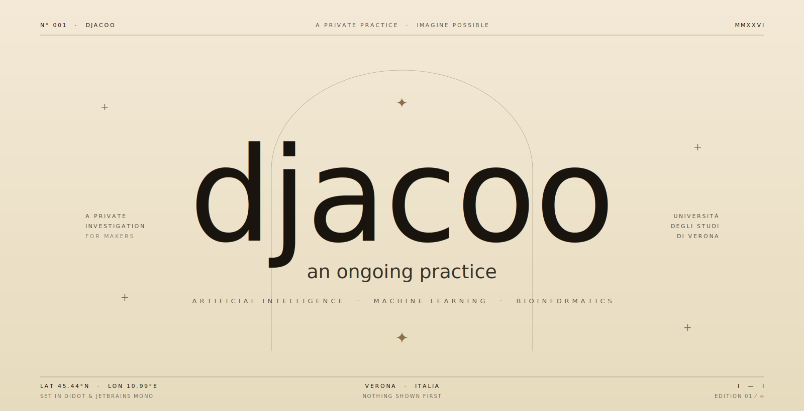

<div align="center">


<br />



</div>

<br />

---

### PRACTICE &nbsp;·&nbsp; N°&nbsp;01

I work at the confluence of **machine learning**, **computational biology**, and **software engineering** — designing models that learn, systems that scale, and abstractions that refuse to leak. Currently reading for an MSc in Artificial Intelligence & Computer Science at the Università degli Studi di Verona, where the questions are harder than the answers and the answers are still the interesting part.

---

### FOCI &nbsp;·&nbsp; N°&nbsp;02

```
01   Machine learning on structured & biological data
02   Generative models, representation learning, interpretability
03   Reproducible scientific computing and tooling for ML
04   Bridges between statistical rigor and engineering discipline
```

---

### STACK &nbsp;·&nbsp; N°&nbsp;03

```
AI  ·  MACHINE LEARNING
     PyTorch   ·   TensorFlow   ·   Keras   ·   scikit-learn   ·   HuggingFace   ·   OpenAI

DATA  ·  SCIENTIFIC COMPUTING
     NumPy   ·   Pandas   ·   SciPy   ·   Jupyter   ·   Biopython   ·   Bioconductor

LANGUAGES
     Python   ·   C++   ·   Java   ·   R   ·   SQL

TOOLS
     Git   ·   Docker   ·   Linux   ·   VS Code
```

---

### COORDINATES &nbsp;·&nbsp; N°&nbsp;04

```
LOCATION      45.44° N   ·   10.99° E
FIELD         Artificial Intelligence   ·   Computer Science
INSTITUTION   Università degli Studi di Verona
STATUS        MSc Candidate   ·   MMXXVI
```

---

### CORRESPONDENCE &nbsp;·&nbsp; N°&nbsp;05

```
GITHUB        github.com/djacoo
EMAIL         jacopo.parretti2003@gmail.com
LINKEDIN      —
```

---

### COLOPHON

> This profile is set in *Didot* and *JetBrains Mono*, composed with deliberate silence and drawn by hand. Curves animate slowly, margins are generous, and — in the manner of the practice itself — *nothing is shown first*.

---

<div align="center">

<sub><code>N°&nbsp;001 &nbsp;·&nbsp; MMXXVI &nbsp;·&nbsp; VERONA &nbsp;·&nbsp; 45.44°N &nbsp;·&nbsp; 10.99°E &nbsp;·&nbsp; EDITION&nbsp;01&nbsp;/&nbsp;∞</code></sub>

</div>
